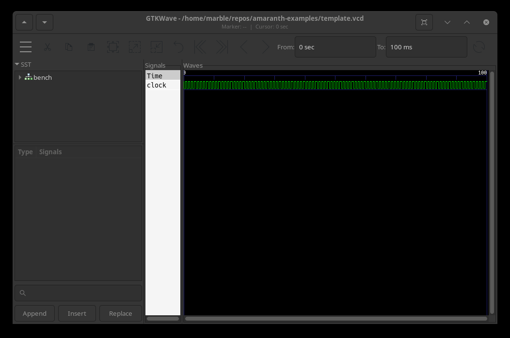

# Template
Template Module

This is a template for executable and testable Amaranth Python modules.
It is supposed to be copied as a starting point for new modules.

## Design
The module contains only the most common elements, like argument parsing, top and submodule instatiation, call to the Amaranth `main_runner` and hardware programing, plus bare bone formal verification.

## Usage
All commands are to be run from the root of this repository.

If you want more information on the options, you can show a help message with the `--help` flag.
```shell
python3 -m template --help
python3 -m template simulate --help
python3 -m template generate --help
```

### Generation
Generate verilog code to use in other toolchain.
```shell
python3 -m template generate --type v
```

### Simulation
Let the design run for 100 clock cycles at 1kHz (= 1 / (1e-3 s)) and view the result.
```shell
python3 -m template simulate -c 100 -p 1e-3 -v template.vcd -w template.gtkw
gtkwave template.gtkw
```

You should see a mostly empty trace plot with only clock and reset running for 100ms.


### Programming
Program the design to actual hardware, for examples the ICEBreaker.
```shell
python3 -m template -p ICEBreaker
```

This should give and ouput like this.
```
init..
cdone: high
reset..
cdone: low
flash ID: 0xEF 0x40 0x18 0x00
file size: 104090
erase 64kB sector at 0x000000..
erase 64kB sector at 0x010000..
programming..
reading..
VERIFY OK
cdone: high
Bye.
```

### Formal Verification
To run formal verification, call the `unittest` Python module with `template` as argument.
```shell
python3 -m unittest template
```
